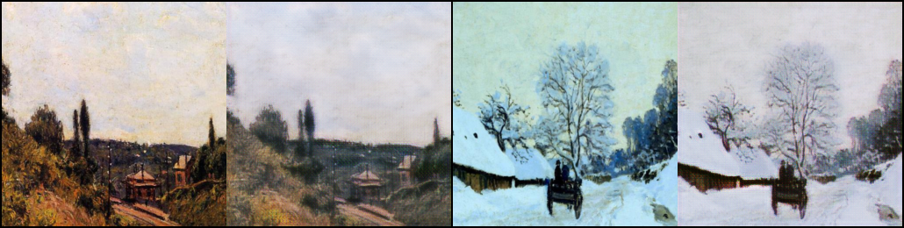

## Style transfer with CycleGAN

### About
This is Pytorch implementation of CycleGAN architecture, trained on the dataset containing photos and paintings of various artists, inspired by the kaggle competition: https://www.kaggle.com/competitions/gan-getting-started. The aim of this project is to transfer the style of the base image to desired domain; in this example model converts real photo to a painting style image and vice versa - a painting to the "real photo". 

### Model architecture and implementation 
Model architecture and parameters were implemented mostly according to the paper: https://arxiv.org/pdf/1703.10593.pdf.
For experimentational purposes to the decoder blocks of the generator were added skip connections from the corresponding encoder layers to imitate U-Net architecture (https://arxiv.org/pdf/1505.04597.pdf).

### Results
Training results - generated every 100 batches photo and painting and plots for each epoch containing models loss - can be found in `training_results/` directory.
#### Generated paintings (base image on the left)

#### Generated photos (base painting on the left)

#### Models losses plot
